# Hi, I'm Elya 👋

### I write code. I ship features. I hunt down bugs and I *end* them.

 

## 🐍 Snake, eating my contribution graph

<picture>
  <source media="(prefers-color-scheme: dark)" srcset="https://raw.githubusercontent.com/eeelya-ab/eeelya-ab/output/github-contribution-grid-snake-dark.svg" />
  <source media="(prefers-color-scheme: light)" srcset="https://raw.githubusercontent.com/eeelya-ab/eeelya-ab/output/github-contribution-grid-snake.svg" />
  
</picture>

 

## 🛠️ Tech I fight bugs with

 

## 📊 Stats

 

## 🗡️ Let's connect

<!-- Paste your handles in and uncomment whichever of these you want.
     Left these off on purpose: I didn't have your LinkedIn/Twitter, and I
     didn't want to publish a work email on a public page without asking.

-->

bugs squashed today: an undisclosed but heroic number 🐞⚔️

